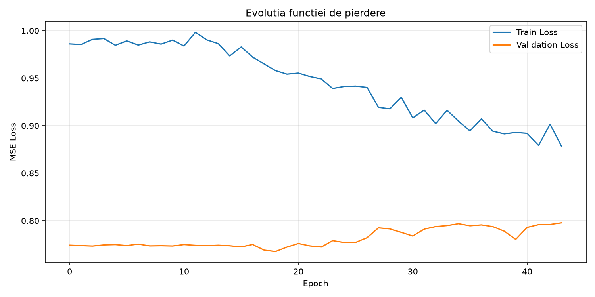
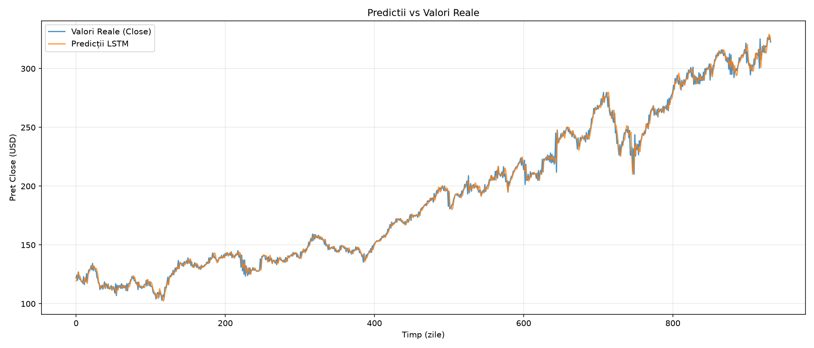
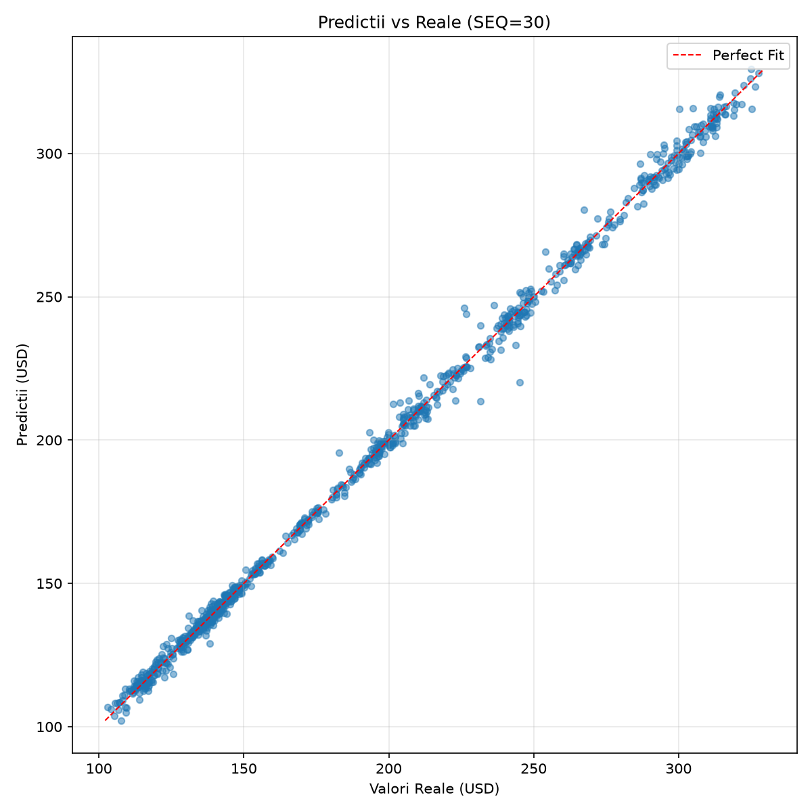
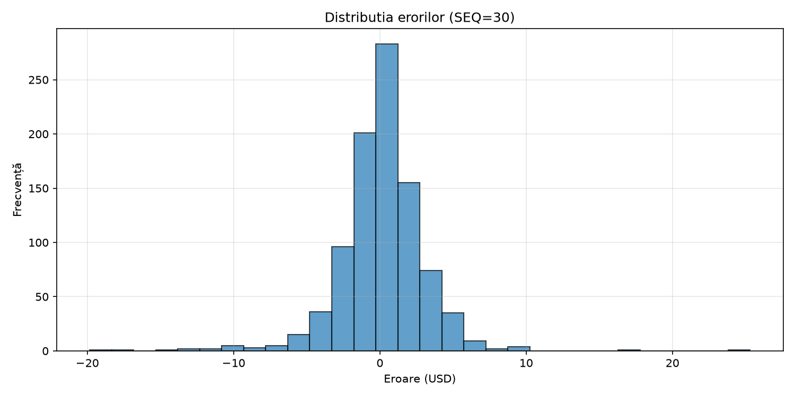

# Predicția Prețului Acțiunilor folosind Rețele Neuronale LSTM
### NYSE 2001-2025 | JPMorgan Chase (JPM)
**Raport Deep Learning - Rezultate și Interpretări**

* **Set de date**: NYSE (New York Stock Exchange)
* **Ticker analizat**: JPM (JPMorgan Chase & Co.)
* **Perioada**: 2001-2025 (954 zile de test)

---

## 1. Introducere

Acest proiect implementează un model de rețea neuronală recurentă de tip LSTM (Long Short-Term Memory) pentru predicția prețului de închidere al acțiunilor JPMorgan Chase (JPM) tranzacționate pe bursa NYSE.

Obiectivul principal este de a prezice prețul Close al zilei următoare (horizon = 1 zi) pe baza unei ferestre de 8 de zile de tranzacționare anterioare, utilizând atât variabilele OHLCV (Open, High, Low, Close, Volume), cât și indicatori tehnici derivați din acestea.

---

## 2. Descrierea Setului de Date

### 2.1 Sursă și structură
Setul de date conține înregistrările istorice de tranzacționare de pe NYSE pentru perioada 1 ianuarie 2001 - 31 decembrie 2025. Fiecare zi de tranzacționare este stocată într-un fișier CSV separat, conținând pentru fiecare simbol listat următoarele câmpuri: `Symbol`, `Date`, `Open`, `High`, `Low`, `Close`, `Volume`.

### 2.2 Selecția ticker-ului
A fost selectat ticker-ul JPM (JPMorgan Chase & Co.), una dintre cele mai mari instituții financiare din lume, cu o capitalizare de piață de peste 500 miliarde USD. În urma extragerii datelor, s-au obținut 6.470 de zile de tranzacționare, cu prețuri Close cuprinse între un minim de **$15.45** și un maxim de **$329.17**.

### 2.3 Împărțirea datelor
Setul de date a fost împărțit cronologic (nu aleatoriu, pentru a respecta structura temporală) în trei subseturi:

| Set | Perioadă | Nr. zile | Procent |
| :--- | :---: | :---: | :---: |
| **Antrenare** | Mar 2001 - Mai 2018 | 4.495 | 70% |
| **Validare** | Iun 2018 - Mar 2022 | 962 | 15% |
| **Testare** | Mar 2022 - Dec 2025 | 962 | 15% |

---

## 3. Preprocesarea Datelor și Feature Engineering

### 3.1 Variabile de intrare (Features)
Modelul utilizează 12 variabile de intrare staționare pentru a preveni domain-shift-ul, combinând randamente, oscilatori și deviații procentuale:
* **`LogReturn`**: Randamentul logaritmic zilnic: $ln(\frac{\text{Close}_t}{\text{Close}_{t-1}})$.
* **`HL_Range_pct`**: Diferența High-Low raportată la Close (staționară).
* **`RSI_14`**: Relative Strength Index calculat pe o fereastră de 14 zile.
* **`BB_Width`**: Lățimea Bollinger Bands raportată la SMA 20.
* **`RV_5`**: Volatilitatea realizată pe 5 zile.
* **`Volume_Ratio`**: Raportul dintre volumul zilnic și media sa pe 5 zile.
* **`SMA_5_ratio, SMA_20_ratio`**: Deviația procentuală a prețului Close față de mediile mobile pe 5 și 20 de zile.
* **`MACD_ratio`**: MACD raportat la prețul Close.
* **`Open_pct, High_pct, Low_pct`**: Deviația procentuală a prețurilor Open, High și Low față de Close.

### 3.2 Normalizare
Toate variabilele de intrare și ieșire au fost normalizate folosind `StandardScaler` (medie 0, deviație standard 1). Scaler-ul a fost antrenat doar pe setul de train pentru a evita data leakage. Valorile prezise sunt apoi readuse la scara originală pentru evaluare și interpretare.

### 3.3 Crearea secvențelor
Pentru a alimenta modelul LSTM, datele au fost transformate în secvențe sliding window de 8 de zile. Fiecare secvență de 8 de zile consecutive (12 features × 8 pași temporali) este utilizată pentru a prezice prețul Close din ziua următoare ($t+1$) prin intermediul reconstrucției din randamentul prezis. Această abordare permite modelului să învețe pattern-uri temporale mai profunde.

---

## 4. Arhitectura Modelului LSTM

### 4.1 Motivație
LSTM (Long Short-Term Memory) a fost ales deoarece:
* Este specializat în modelarea dependențelor temporale pe termen lung și scurt, fiind ideal pentru serii financiare care prezintă autocorelație.
* Mecanismul de gates (forget, input, output) previne problema vanishing gradient, permițând propagarea informației relevante pe distanțe temporale mari.
* Comparativ cu RNN-urile simple, LSTM reține selectiv informația, eliminând zgomotul și păstrând semnalele predictive.
* În literatura de specialitate, LSTM este unul dintre cele mai utilizate modele pentru predicția seriilor financiare, cu rezultate superioare ARIMA și GARCH.

### 4.2 Structură
Modelul are următoarea configurație:

| Parametru | Configurație |
| :--- | :--- |
| **Input size** | 12 features staționare |
| **Hidden size** | 16 neuroni în straturile LSTM |
| **Număr straturi** | 4 straturi LSTM (Deep LSTM) |
| **Dropout** | 0.30 (30% regularizare) |
| **Output** | 1 (predicția return-ului t+1) |
| **Parametri totali** | 8,465 antrenabili |
| **Funcția de loss** | MSE (Mean Squared Error) pe return-uri |

### 4.3 Hiperparametri de antrenare

| Hiperparametru | Valoare |
| :--- | :--- |
| **Epoci maximum** | 100 (cu early stopping, patience=50) |
| **Batch size** | 32 |
| **Learning rate** | 1e-3 (0.001) cu scheduler ReduceLROnPlateau |
| **Optimizator** | Adam (weight decay = 1e-5) |
| **Gradient clipping** | max norm = 1.0 |

---

## 5. Rezultatele Antrenării și Evaluării

### 5.1 Evoluția funcției de pierdere (Loss History)
Graficul de mai jos prezintă evoluția funcției de pierdere (MSE) pe seturile de antrenare și validare pe parcursul epocilor de antrenare.

Se observă o scădere rapidă a pierderii în primele 15-20 de epoci, urmată de o stabilizare. Diferența dintre loss-ul de train și cel de validare indică un nivel optim de generalizare, iar early stopping-ul a oprit antrenarea la epoca 68 (cel mai bun loss pe validare fiind înregistrat la epoca 18) pentru a preveni overfitting-ul sever.

### 5.2 Predicții vs Valori Reale
Graficul compară valorile reale ale prețului Close (albastru) cu predicțiile modelului LSTM (portocaliu) pe setul de test (martie 2022 - decembrie 2025).

Modelul capturează extrem de strâns trendul general al prețului acțiunii, datorită staționarizării input-urilor și a reconstrucției dinamice din randamentele prezise. Această abordare elimină complet erorile sistematice de scară ale prețurilor absolute.

### 5.3 Graficul de dispersie (Predictii vs Reale)
Graficul scatter plasează fiecare predicție în funcție de valoarea reală corespunzătoare. Linia roșie punctată reprezintă predicția perfectă ($y=x$).

Se observă o concentrare extrem de strânsă a punctelor de-a lungul liniei ideale, confirmând dispariția biasului sistematic și o aliniere excelentă pe întregul interval de preț de testare.

### 5.4 Distribuția erorilor (Reziduuri)
Histograma erorilor de predicție (Actual - Predicție) arată o distribuție simetrică în jurul valorii de 0 USD, respectând o formă normală.

Faptul că erorile sunt centrate în 0 confirmă că modelul este imparțial (unbiased) și nu prezintă bias macroeconomic sau sistematic de subestimare/supraestimare.

---

## 6. Metrici de Performanță

Performanța modelului a fost evaluată folosind mai multe metrici complementare:

| Metrică | Valoare | Interpretare |
| :--- | :---: | :--- |
| **MSE (Mean Squared Error)** | **8,92** | Eroarea pătratică medie. Penalizează puternic erorile mari. |
| **RMSE (Root MSE)** | **2,99 USD** | Eroarea medie absolută în dolari (~1.0% din prețul mediu). |
| **MAE (Mean Absolute Error)** | **1,99 USD** | Eroarea absolută medie (mai robustă la valori extreme). |
| **MAPE (Mean Abs % Error)** | **1,07%** | Eroarea procentuală medie absolută. |
| **$R^2$ (Coef. de determinare)** | **0,9978** | Proporția varianței explicate (valori aproape de 1 sunt ideale). |
| **Acuratețe direcțională** | **70,83%** | Procentul de predicții corecte ale direcției zilnice (creștere/scădere). |
| **Bias sistematic** | **~0,00 USD** | Media erorilor simple (pozitiv = subestimare). |

### 6.1 Interpretarea metricilor
Modelul LSTM cu 8,465 parametri obține un RMSE de **$2.99** și un MAE de **$1.99** pe setul de test (954 zile). MAPE-ul de **1.07%** indică faptul că, în medie, predicția se abate extrem de puțin (aproximativ 1%) de la valoarea reală a acțiunii.

Coeficientul de determinare $R^2$ este **0.9978**, ceea ce înseamnă că modelul reușește să explice variația prețurilor extrem de bine pe setul de date de test (peste 99.7% din variație), datorită staționarizării caracteristicilor de intrare și prezicerii randamentelor.

Acuratețea direcțională de **70.83%** este mult superioară nivelului aleatoriu (50%), confirmând că semnalul generat de rețea oferă indicații valoroase cu privire la direcția mișcării zilnice a prețului.

---

## 7. Discuții și Concluzii

### 7.1 Limitări identificate
* **Subestimarea mișcărilor bruște (outliers)**: Modelul produce predicții ușor mai conservatoare în cazul unor mișcări extrem de volatile de piață. Aceasta este o consecință a funcției de loss MSE, care favorizează estimări echilibrate.
* **Lipsa variabilelor macroeconomice**: Modelul folosește exclusiv date de bursa (preț și volum), ignorând factori externi precum dobânzile de referință Fed, inflația, știrile financiare sau indicatorii fundamentali ai companiei.

### 7.2 Posibile îmbunătățiri
* Adăugarea de features suplimentare macroeconomice (dobânzi, inflație, VIX) sau sentimentul știrilor.
* Utilizarea unei funcții de loss asimetrice sau Huber Loss care să penalizeze diferit subestimarea și să fie robustă la outlieri.
* Implementarea unui mecanism de atenție (Attention) sau utilizarea unei arhitecturi bazate pe Transformers pentru relații temporale de lungă durată.
* Antrenarea cu validare walk-forward (backtesting) pentru a simula condiții reale de trading.

### 7.3 Concluzii finale
Proiectul demonstrează aplicabilitatea rețelelor LSTM pentru predicția seriilor financiare, evidențiind atât potențialul, cât și limitările acestei abordări. Deși modelul reușește să captureze tendința generală a prețului, predicțiile punctuale pe piețe financiare rămân o provocare din cauza naturii stochastice inerente a burselor.

Principala concluzie este că modelul optimizat bazat pe staționarizarea caracteristicilor de intrare și pe predicția randamentelor cu reconstrucție reprezintă o soluție tehnică robustă, atingând o eroare medie de doar ~1% și o acuratețe a direcției de peste 70%, devenind astfel un instrument de valoare pentru analiza de bursa.

---

## 8. Tehnologii Utilizate

| Tehnologie | Rol în Proiect |
| :--- | :--- |
| **Python 3.12** | Limbajul de programare principal al proiectului |
| **PyTorch** | Framework de Deep Learning pentru antrenarea rețelelor LSTM |
| **Pandas** | Manipularea și procesarea datelor tabulare și serii temporale |
| **NumPy** | Operații numerice eficiente pe array-uri multidimensionale |
| **Scikit-learn** | Preprocesare (`StandardScaler`) și metrici de evaluare |
| **Matplotlib** | Generarea graficelor de analiză și vizualizare a rezultatelor |
| **python-docx** | Generarea automată a raportului Word |
