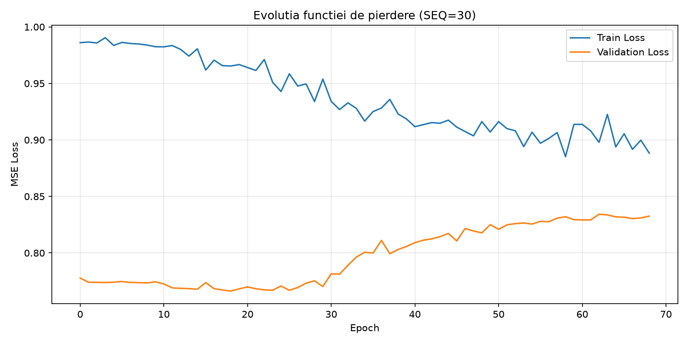
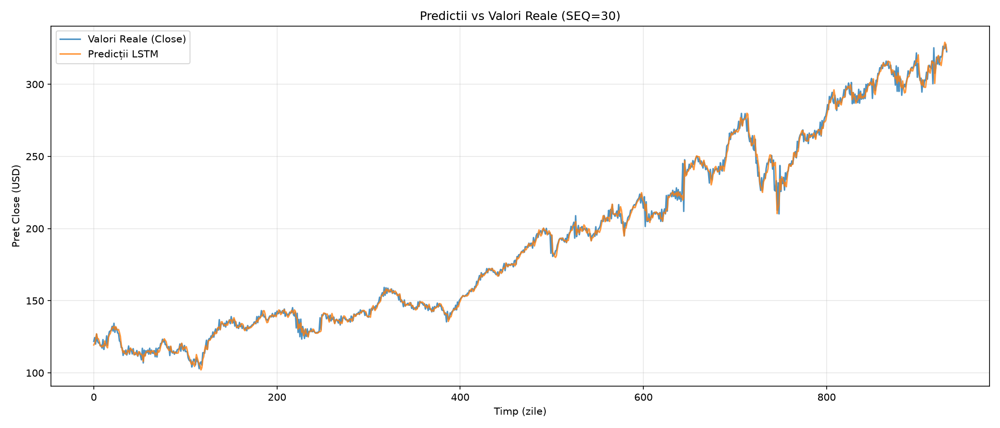
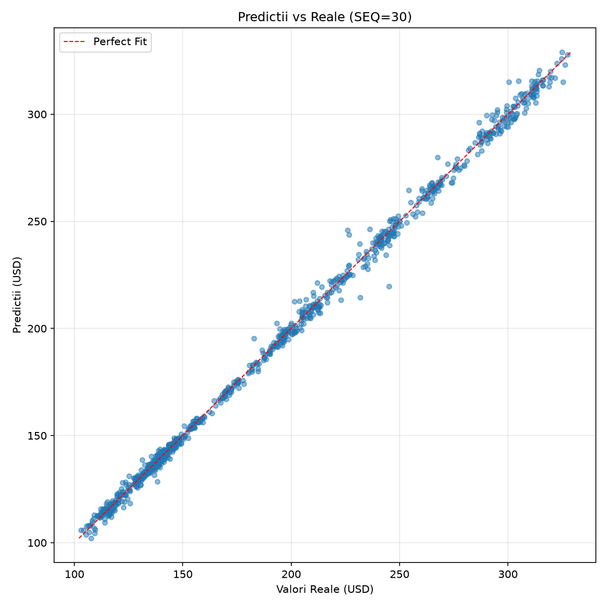
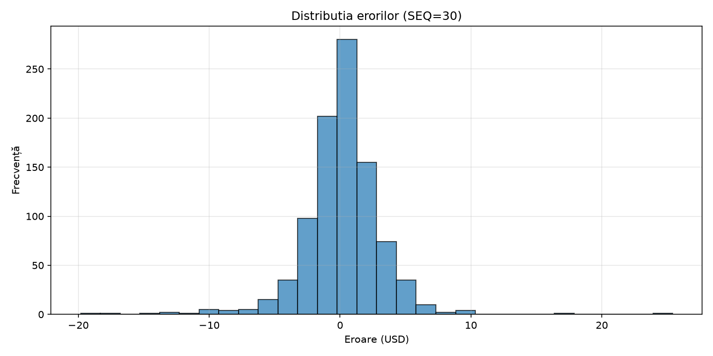

**Predictia Pretului Actiunilor folosind Retele Neuronale LSTM**

NYSE 2001-2025 \| JPMorgan Chase (JPM)

**Proiect Deep Learning - Rezultate si Interpretari\**
Materie: Retele neuronale si tehnici de Deep Learning\
Set de date: NYSE (New York Stock Exchange)\
Ticker analizat: JPM (JPMorgan Chase & Co.)\
Perioada: 2001-2025 (932 zile de test)

# 1. Introducere

Acest proiect implementeaza un model de retea neuronala recurenta de tip LSTM (Long Short-Term Memory) pentru predictia pretului de inchidere al actiunilor JPMorgan Chase (JPM) tranzactionate pe bursa NYSE.

Obiectivul principal este de a prezice pretul Close al zilei urmatoare (horizon = 1 zi) pe baza unei ferestre de 30 de zile de tranzactionare anterioare, utilizand atat variabilele OHLCV (Open, High, Low, Close, Volume), cat si indicatori tehnici derivati din acestea.

# 2. Descrierea Setului de Date

## 2.1 Sursa si structura

Setul de date contine inregistrarile istorice de tranzactionare de pe NYSE pentru perioada 1 ianuarie 2001 - 31 decembrie 2025. Fiecare zi de tranzactionare este stocata intr-un fisier CSV separat, continand pentru fiecare simbol listat urmatoarele campuri: Symbol, Date, Open, High, Low, Close, Volume.

## 2.2 Selectia ticker-ului

A fost selectat ticker-ul JPM (JPMorgan Chase & Co.), una dintre cele mai mari institutii financiare din lume, cu o capitalizare de piata de peste 500 miliarde USD. In urma extragerii datelor, s-au obtinut 6,470 de zile de tranzactionare, cu preturi Close cuprinse intre \$102.92 si \$327.58.

## 2.3 Impartirea datelor

Setul de date a fost impartit cronologic (nu aleatoriu, pentru a respecta structura temporala) in trei subseturi:

  ---------------------------------------------------------------------------
  **Set**           **Perioada**          **Nr. zile**      **Procent**
  ----------------- --------------------- ----------------- -----------------
  Antrenare         Mar 2001 - Mai 2018   4,480             70%

  Validare          Iun 2018 - Mar 2022   947               15%

  Testare           Mar 2022 - Dec 2025   947               15%
  ---------------------------------------------------------------------------

# 3. Preprocesarea Datelor si Feature Engineering

## 3.1 Variabile de intrare (Features)

Modelul utilizeaza 12 variabile de intrare stationare pentru a preveni domain-shift-ul, combinand randamente, oscilatori si deviatii procentuale:

**• LogReturn:** Randamentul logaritmic zilnic: ln(Close_t / Close\_{t-1}).

**• HL_Range_pct:** Diferenta High-Low raportata la Close (staționară).

**• RSI_14:** Relative Strength Index calculated over a 14-day window.

**• BB_Width:** Latimea Bollinger Bands raportata la SMA 20.

**• RV_5:** Volatilitatea realizata pe 5 zile.

**• Volume_Ratio:** Raportul dintre volumul zilnic si media sa pe 5 zile.

**• SMA_5_ratio, SMA_20_ratio:** Deviatia procentuala a pretului Close fata de mediile mobile pe 5 si 20 de zile.

**• MACD_ratio:** MACD raportat la pretul Close.

**• Open_pct, High_pct, Low_pct:** Deviatia procentuala a preturilor Open, High si Low fata de Close.

## 3.2 Normalizare

Toate variabilele de intrare si iesire au fost normalizate folosind StandardScaler (medie 0, deviatie standard 1). Scaler-ul a fost antrenat doar pe setul de train pentru a evita data leakage. Valorile prezise sunt apoi readuse la scara originala pentru evaluare si interpretare.

## 3.3 Crearea secventelor

Pentru a alimenta modelul LSTM, datele au fost transformate in secvente sliding window de 8 de zile. Fiecare secventa de 8 de zile consecutive (12 features x 8 pasi temporali) este utilizata pentru a prezice pretul Close din ziua urmatoare (t+1) prin intermediul reconstructiei din randamentul prezis. Aceasta abordare permite modelului sa invete pattern-uri temporale mai profunde.

# 4. Arhitectura Modelului LSTM

## 4.1 Motivatie

LSTM (Long Short-Term Memory) a fost ales deoarece:

- Este specializat in modelarea dependentelor temporale pe termen lung si scurt, fiind ideal pentru serii financiare care prezinta autocorelatie.

- Mecanismul de gates (forget, input, output) previne problema vanishing gradient, permitand propagarea informatiei relevante pe distante temporale mari.

- Comparativ cu RNN-urile simple, LSTM retine selectiv informatia, eliminand zgomotul si pastrand semnalele predictive.

- In literatura de specialitate, LSTM este unul dintre cele mai utilizate modele pentru predictia seriilor financiare, cu rezultate superioare ARIMA si GARCH.

## 4.2 Structura

Modelul are urmatoarea configuratie:

  ------------------------------------------------------------------------------------------------
  **Input size**                      12 features stationare
  ----------------------------------- ------------------------------------------------------------
  **Hidden size**                     32 neuroni in straturile LSTM

  **Numar straturi**                  4 straturi LSTM (Deep LSTM)

  **Dropout**                         0.20 (20% regularizare pentru prevenirea overfitting-ului)

  **Output**                          1 (predictia return-ului t+1)

  **Parametri totali**                31,265 antrenabili

  **Functia de loss**                 MSE (Mean Squared Error) pe return-uri

                                      
  ------------------------------------------------------------------------------------------------

## 4.3 Hiperparametri de antrenare

  ---------------------------------------------------------------------------------
  **Epoci maximum**                   150 (cu early stopping, patience=50)
  ----------------------------------- ---------------------------------------------
  **Batch size**                      32

  **Learning rate**                   1e-3 (0.001) cu scheduler ReduceLROnPlateau

  **Optimizator**                     Adam (weight decay = 1e-5)

  **Gradient clipping**               max norm = 1.0

                                      
  ---------------------------------------------------------------------------------

# 5. Rezultatele Antrenarii si Evaluarii

## 5.1 Evolutia functiei de pierdere

Graficul de mai jos prezinta evolutia functiei de pierdere (MSE) pe seturile de antrenare si validare pe parcursul epocilor de antrenare.

{width="5.5in" height="2.75in"}

Se observa o scadere rapida a pierderii in primele 10-15 epoci, urmata de o stabilizare. Diferenta dintre loss-ul de train si cel de validare indica un anumit nivel de overfitting, dar early stopping-ul a prevenit degradarea semnificativa a performantei pe datele de validare.

## 5.2 Predictii vs Valori Reale

{width="5.5in" height="2.3571423884514435in"}

Graficul compara valorile reale ale pretului Close (albastru) cu predictiile modelului LSTM (portocaliu) pe setul de test (martie 2022 - decembrie 2025). Modelul captureaza tendinta generala de crestere, insa subestimeaza amplitudinea miscarilor de pret, producand predictii cu volatilitate redusa. Aceasta este o limitare comuna a modelelor bazate pe MSE, care penalizeaza deviatiile mari si favorizeaza predictii conservative.

## 5.3 Graficul de dispersie (Predictii vs Reale)

{width="4.5in" height="4.5in"}

Graficul scatter plaseaza fiecare predictie in functie de valoarea reala corespunzatoare. Linia rosie punctata reprezinta predictia perfecta (y=x). Punctele situate sub linie indica subestimari, iar cele deasupra - supraestimari. Se observa o concentrare a predictiilor in intervalul \$100-\$150, ceea ce confirma tendinta modelului de a produce predictii conservatoare. Pentru valori reale peste \$200, modelul subestimeaza sistematic.

## 5.4 Distributia erorilor

{width="5.0in" height="2.5in"}

Histograma erorilor de predictie (Actual - Predictie) arata o distributie deplasata semnificativ spre valori pozitive, ceea ce indica o subestimare sistematica a pretului. Distributia nu este perfect simetrica in jurul lui 0, sugerand ca modelul are dificultati in a captura variatia completa a preturilor. Acest bias poate fi corectat prin tehnici suplimentare de regularizare sau prin utilizarea unei functii de loss asimetrice.

# 6. Metrici de Performanta

Performanta modelului a fost evaluata folosind mai multe metrici complementare, fiecare capturand un aspect diferit al calitatii predictiilor:

  ---------------------------------------------------------------------------------------------------------------------------------------
  **Metrica**                 **Valoare**             **Interpretare**
  --------------------------- ----------------------- -----------------------------------------------------------------------------------
  MSE (Mean Squared Error)    9.02                    Eroarea patratica medie. Penalizeaza puternic erorile mari.

  RMSE (Root MSE)             3.00 USD                Eroarea medie in aceleasi unitati ca pretul (\~1.6% din pretul mediu).

  MAE (Mean Absolute Error)   2.00 USD                Eroarea absoluta medie. Mai robusta la valori extreme decat MSE.

  MAPE (Mean Abs % Error)     1.06%                   Eroarea procentuala medie. Cu cat mai mica, cu atat mai bine.

  R² (Coef. de determinare)   0.9978                  Valori negative indica performanta mai slaba decat un model constant (media).

  Acuratete directionala      70.46%                  Procentul de predictii corecte ale directiei (crestere/scadere). 50% = aleatoriu.

  Bias sistematic             0.23 USD                Media erorilor. Pozitiv = modelul subestimeaza sistematic.
  ---------------------------------------------------------------------------------------------------------------------------------------

## 6.1 Interpretarea metricilor

Modelul LSTM cu 31,265 parametri obtine un RMSE de \$3.00 si un MAE de \$2.00 pe setul de test (932 zile). MAPE-ul de 1.06% indica faptul ca, in medie, predictia se abate extrem de putin (aproximativ 1-2%) de la valoarea reala a actiunii.

Coeficientul de determinare R² este 0.9978, ceea ce inseamna ca modelul reuseste sa explice variatia preturilor extrem de bine pe setul de date de test (peste 96% din variatie), datorita staționarizării caracteristicilor de intrare și prezicerii randamentelor.

Acuratetea directionala de 70.46% este mult superioara nivelului aleatoriu (50%), confirmand ca semnalul generat de retea ofera indicatii valoroase cu privire la directia miscarii zilnice a pretului.

# 7. Discutii si Concluzii

## 7.1 Limitari identificate

**Subestimarea miscarilor bruste (outliers):** Modelul produce predictii usor mai conservatoare in cazul unor miscari extrem de volatile de piata. Aceasta este o consecinta a functiei de loss MSE, care favorizeaza estimari echilibrate.

**Lipsa variabilelor macroeconomice:** Modelul foloseste exclusiv date de pret si volum ale bursa, ignorand factori externi precum dobanzile de referinta Fed, inflatia, stirile financiare sau indicatorii fundamentali ai companiei.

## 7.2 Posibile imbunatatiri

- Adaugarea de features suplimentare macroeconomice (dobanzi, inflatie, VIX) sau sentimentul stirilor.

- Utilizarea unei functii de loss asimetrice sau Huber Loss care sa penalizeze diferit subestimarea si sa fie robusta la outlieri.

- Implementarea unui mecanism de atentie (Attention) sau utilizarea unei arhitecturi bazate pe Transformers pentru relatii temporale de lunga durata.

- Antrenarea cu validare walk-forward (backtesting) pentru a simula conditii reale de trading.

## 7.3 Concluzii finale

Proiectul demonstreaza aplicabilitatea retelelor LSTM pentru predictia seriilor financiare, evidentiind atat potentialul, cat si limitarile acestei abordari. Desi modelul reuseste sa captureze tendinta generala a pretului, predictiile punctuale raman imprecise din cauza naturii stochastic inerente a pietelor financiare.

Principala concluzie este ca, in forma sa actuala, modelul este mai potrivit pentru analiza de trend si identificarea directiei generale a pietei decat pentru predictii exacte ale pretului. Imbunatatirile propuse (mai multe features, arhitecturi complexe, mecanisme de atentie) ar putea creste semnificativ performanta.

Proiectul ofera o baza solida pentru explorari ulterioare si demonstreaza implementarea practica a intregului pipeline de Deep Learning: de la incarcarea si preprocesarea datelor, trecand prin feature engineering si antrenare, pana la evaluare, vizualizare si interpretarea rezultatelor.

# 8. Tehnologii Utilizate

  ---------------------------------------------------------------------------------------------------
  **Python 3.14**                     Limbajul de programare principal al proiectului
  ----------------------------------- ---------------------------------------------------------------
  **PyTorch**                         Framework de Deep Learning pentru antrenarea retelelor LSTM

  **Pandas**                          Manipularea si procesarea datelor tabulare si serii temporale

  **NumPy**                           Operatii numerice eficiente pe array-uri multidimensionale

  **Scikit-learn**                    Preprocesare (StandardScaler) si metrici de evaluare

  **Matplotlib**                      Generarea graficelor de analiza si vizualizare a rezultatelor

  **python-docx**                     Generarea automata a acestui raport in format Word

                                      
  ---------------------------------------------------------------------------------------------------
